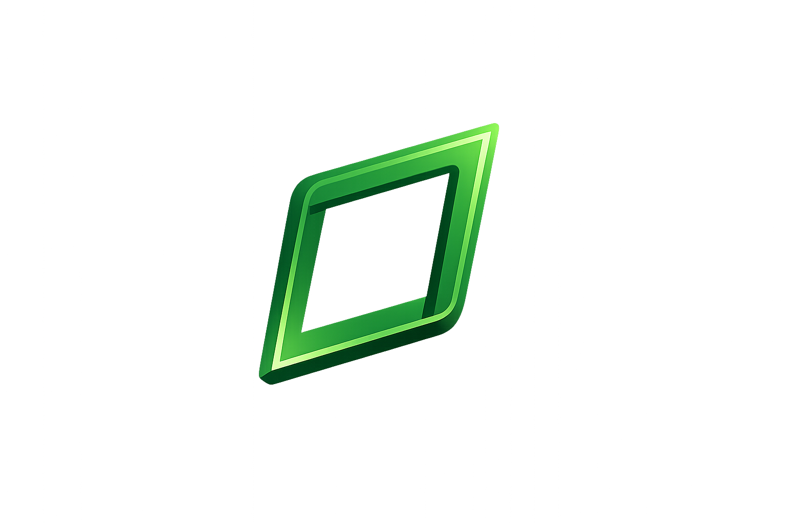
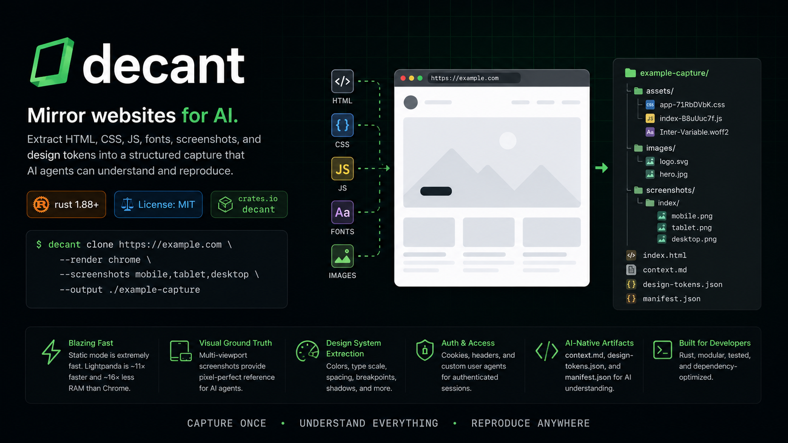

<div align="center">



# decant

> **Mirror websites for AI.** Extract HTML, CSS, JS, fonts, screenshots, and design tokens into a structured capture that AI agents can understand and reproduce.

[](https://www.rust-lang.org)
[](LICENSE)
[](https://crates.io/crates/decant)

</div>



---

## What is decant?

`decant` is an AI-native website mirroring tool written in Rust. It downloads a site's complete UI layer — HTML, CSS, JS, web fonts, and images — rewrites all references to relative local paths so the capture works offline, and outputs three machine-readable artifacts:

| File | Purpose |
|---|---|
| `context.md` | Token-budgeted LLM primer — paste this into your prompt first |
| `design-tokens.json` | Full color palette, type scale, spacing, breakpoints, shadows |
| `manifest.json` | Page tree, component regions, and asset catalog |

When used with `--render chrome`, decant also captures **multi-viewport screenshots** (mobile, tablet, desktop) so an AI agent has a visual ground truth to compare against.

---

## Features

- **Static Mirroring** — extremely fast HTML/CSS/JS/asset crawl without a browser
- **Headless Chrome** — full JavaScript rendering (`--render chrome`), cookie injection, multi-viewport screenshots
- **Lightpanda** — ultra-fast (~11× faster, ~16× less RAM than Chrome) JS rendering (`--render lightpanda`) — no screenshots, pure DOM extraction
- **Design Token Extraction** — colors, font families, spacing scale, breakpoints, radii, shadows from every stylesheet
- **URL Rewriting** — all absolute and root-relative references rewritten to relative local paths for offline use
- **JS Chunk Discovery** — scans compiled JS bundles to find and download dynamically-imported chunks (Vite, webpack, etc.)
- **Cookie & Header Auth** — inline cookie string (`--cookies`) or Netscape cookie jar (`--cookie-file`) + custom request headers (`--header`)
- **Selective Capture** — choose exactly which aspects to collect via `--capture html,css,js,fonts,screenshots,tokens,context`
- **Multi-Viewport Screenshots** — `mobile` (390×844), `tablet` (768×1024), `desktop` (1440×900)
- **TUI Dashboard** — real-time crawl progress with a ratatui terminal UI
- **Offline Preview** — serve any capture directory locally with `decant serve`
- **robots.txt** — respected by default; bypass with `--ignore-robots`

---

## Installation

### Option 1 — Cargo (recommended)

```bash
# Static crawl only (no browser dependency — fastest install)
cargo install decant-cli

# With headless-browser support (Chrome + Lightpanda)
cargo install decant-cli --features render
```

After install, `decant` is on your `$PATH` immediately.

### Option 2 — npm / npx

```bash
# Install globally
npm install -g decant

# Or run without installing (one-shot)
npx decant clone https://example.com --output ./capture
```

### Option 3 — curl (Linux / macOS)

```bash
curl -fsSL https://raw.githubusercontent.com/codingstark-dev/decant/main/install.sh | sh
```

### Option 4 — Build from source

```bash
git clone https://github.com/codingstark-dev/decant
cd decant

# Static crawl only
cargo build --release

# With headless-browser support
cargo build --release --features render

# Add to PATH
export PATH="$PWD/target/release:$PATH"
```

### Requirements

- **Chrome/Chromium** — required only when using `--render chrome`
- **Lightpanda** — required only when using `--render lightpanda`; install from [lightpanda.io](https://lightpanda.io)

---

## Quick Start

### 1. Static clone (fast, no browser)

```bash
decant clone https://example.com --output ./example-capture
```

### 2. Chrome clone with screenshots

```bash
decant clone https://example.com \
  --render chrome \
  --screenshots mobile,tablet,desktop \
  --output ./example-chrome
```

### 3. Lightpanda clone (lightweight JS, no screenshots)

```bash
decant clone https://spa.example.com \
  --render lightpanda \
  --output ./example-lp
```

### 4. Authenticated clone behind a session cookie

```bash
decant clone https://app.example.com \
  --cookies "session=abc123; csrf=xyz789" \
  --header "Authorization: Bearer eyJhbGciOi..." \
  --output ./auth-capture
```

### 5. Selective capture (HTML + screenshots only, skip JS/fonts)

```bash
decant clone https://example.com \
  --render chrome \
  --capture html,screenshots \
  --output ./visual-only
```

### 6. Serve a captured site locally

```bash
# Standard serve
decant serve ./example-capture --port 8080

# SPA captures (Next.js / React) — strip scripts to prevent client-side errors
decant serve ./example-capture --port 8080 --noscript
# Open http://localhost:8080
```


## Output Structure

```
./output-dir/
├── index.html               # Rewritten HTML (relative links)
├── about/
│   └── index.html           # Nested pages follow URL structure
├── assets/
│   ├── app-71RbDVbK.css     # Stylesheets with rewritten font/image references
│   ├── index-B8uUuc7f.js    # JS entry chunk
│   └── chunk-XYZ.js         # Dynamically discovered code-split chunks
├── screenshots/
│   ├── index/
│   │   ├── mobile.png       # 390×844 — iPhone 14 viewport
│   │   ├── tablet.png       # 768×1024 — iPad viewport
│   │   └── desktop.png      # 1440×900 — laptop viewport
│   └── about/
│       └── ...
├── context.md               # AI-native LLM primer (start here)
├── design-tokens.json       # Full design system tokens
└── manifest.json            # Page tree + asset catalog
```

<details>
<summary>Example: context.md (Click to expand)</summary>

```markdown
# decant capture — context.md

> Read this file first. It is a token-budgeted primer.
> Then consult `design-tokens.json` and `manifest.json` for full detail.

## Overview

- **Seed URL**: https://example.com/
- **Captured at**: 2026-06-16 12:56:22 UTC
- **Render mode**: rendered
- **Pages captured**: 1
- **Assets captured**: 23
- **Total size**: 2.1 MB

## Pages

- **/** → `index.html`
  - Title: Example Site
  - Regions: header, nav, main, footer, hero, testimonial

## Captured Screenshots

- `screenshots/index/mobile.png`
- `screenshots/index/tablet.png`
- `screenshots/index/desktop.png`

## Key Design Tokens

### Colors
Palette: `#0b0b0c` `#ffffff` `#000000` `#6366f1` `#e0e7ff`

### Spacing
`2px` `4px` `8px` `12px` `16px` `24px` `32px` `48px`

### Breakpoints
640px, 768px, 1024px, 1280px

## How to Use This Capture
1. **You are here** — this file orients you without burning context.
2. **`design-tokens.json`** — full color palette, type scale, spacing, radii, shadows, breakpoints. Translate into your target stack (Tailwind config / CSS custom properties / design system tokens).
3. **`manifest.json`** — page tree and component region breakdown. Build one component per listed region.
4. **Raw HTML/CSS files** — open only when you need exact markup or a specific class name. Reproduce structure and styling approach, not class names verbatim.
5. **`screenshots/`** — visual ground truth. Compare your output against these images at matching breakpoints.
```

</details>

<details>
<summary>Example: design-tokens.json (Click to expand)</summary>

```json
{
  "schemaVersion": "1.0",
  "source": "https://example.com/",
  "capturedAt": "2026-06-16T12:56:01.537658Z",
  "colors": {
    "swatches": [
      "#fff",
      "#000",
      "#0b0b0c",
      "#6366f1",
      "#e0e7ff"
    ],
    "byUsage": {}
  },
  "typography": {
    "fontFamilies": ["Inter", "sans-serif"],
    "scale": ["12px", "14px", "16px", "20px", "24px", "32px", "48px"],
    "lineHeights": ["1.2", "1.5"],
    "fontWeights": ["400", "500", "700"]
  },
  "spacing": [2.0, 4.0, 8.0, 12.0, 16.0, 24.0, 32.0, 48.0],
  "breakpoints": [640, 768, 1024, 1280],
  "radii": ["4px", "8px", "12px", "9999px"],
  "shadows": ["0 1px 2px 0 rgba(0, 0, 0, 0.05)", "0 4px 6px -1px rgba(0, 0, 0, 0.1)"]
}
```

</details>

---

## CLI Reference

### `decant clone <URL> [OPTIONS]`

| Option | Default | Description |
|---|---|---|
| `--output <DIR>` | `<hostname>` | Output directory |
| `--depth <N>` | `0` | Link-follow recursion depth (0 = single page) |
| `--render <chrome\|lightpanda>` | *(off)* | Enable JS rendering via headless browser |
| `--screenshots <VIEWPORTS>` | `mobile,tablet,desktop` | Comma list of viewports (requires `--render chrome`) |
| `--no-screenshots` | false | Disable screenshots even with `--render chrome` |
| `--capture <ASPECTS>` | `html,css,js,fonts,tokens,context` | Comma list: html, css, js, fonts, images, screenshots, tokens, context |
| `--cookies <STRING>` | — | Inline cookie: `"name=val; name2=val2"` |
| `--cookie-file <PATH>` | — | Netscape cookie jar file path |
| `--header <KEY:VALUE>` | — | Extra request header (repeatable) |
| `--user-agent <STRING>` | decant/<version> | Override the User-Agent header |
| `--concurrency <N>` | `16` | Max parallel HTTP requests |
| `--rate-limit <R>` | `4` | Max requests/second per host |
| `--ignore-robots` | false | Bypass robots.txt |
| `--same-origin` | true | Only follow links on the same origin |
| `--allow-domains <D1,D2>` | — | Extra domains to crawl (e.g. CDN hosts) |
| `--no-tokens` | false | Skip design-tokens.json |
| `--no-manifest` | false | Skip manifest.json / context.md |
| `--tui <true\|false>` | auto | Force TUI on/off (auto-detects TTY) |

> [!NOTE]
> **Why is `--depth 0` the default?** Unlike general-purpose web crawlers (like HTTrack) that recursively scrape entire websites by default, `decant` defaults to a single-page mirror (`--depth 0`). For AI code generation and visual reference, you usually want to feed a single, specific reference page at a time to stay within LLM token budgets. If you need multi-page crawling, pass `--depth 2` or higher.


### `decant serve <DIR> [OPTIONS]`

| Option | Default | Description |
|---|---|---|
| `--port <N>` | `8080` | Port to listen on |
| `--host <ADDR>` | `127.0.0.1` | Address to bind to |
| `--noscript` | `false` | Strip all script tags on-the-fly to prevent client-side hydration crashes on modern SPAs (Next.js, React, etc.) |

> [!TIP]
> **Hydration Crashes on Local Preview:** Modern SPAs (like Next.js or TanStack Start) attempt to execute client-side hydration when loaded in the browser. Since the backend APIs do not exist on the local port, this execution can crash or wipe out the DOM. Use `decant serve <DIR> --noscript` to dynamically strip scripts on-the-fly, allowing you to preview the static mirrored UI and styling cleanly.


### `decant tokens <DIR>`

Re-run design-token extraction on an existing capture directory without re-downloading anything.

---

## Compatibility

| Site Type | Support |
|---|---|
| Static HTML sites | ✅ Full support |
| React/Vue SPAs with SSR/prerendering | ✅ Full support |
| React/Vue client-only SPAs | ✅ Use `--render chrome` or `--render lightpanda` |
| Sites behind session auth | ✅ Use `--cookies` or `--cookie-file` |
| Multi-page sites | ✅ Use `--depth 2` or higher to follow links |
| Sites with Cloudflare/bot protection | ⚠️ May get 403/429 — inject real session cookies |
| React Native / Electron apps | ❌ Not applicable |

---

## Benchmarks

Measured against **[multigres.com](https://multigres.com)** (a real-world Astro/Vite SPA) on Apple M-series.  
All three modes use `--depth 0` (single-page render) for a fair head-to-head comparison.  
Run: `python3 benchmark.py https://your-site.com`

```
decant benchmark — target: https://multigres.com
============================================================
 RESULTS  (depth=0, single-page, same URL)
============================================================
Mode                       Time (s)  Peak RAM (MB)
------------------------------------------------------------
Static (no browser)            23.0             20
Lightpanda (JS)                28.2             45    (1.2× slower)
Chrome (headless)              26.5           1066    (1.2× slower)
------------------------------------------------------------
→ Lightpanda uses 24× less RAM than Chrome
→ Static mode uses 53× less RAM than Chrome
```

**Key observations:**

- **All three modes are near-identical in speed** — decant's rate limiter (4 req/s) is the bottleneck, not the browser. You get JS rendering for free in time terms.
- **Lightpanda: 45 MB vs Chrome: 1 GB** — 24× less RAM for the same JS execution. The right choice for servers, CI, and Docker containers.
- **Static: 20 MB** — zero browser overhead. Perfect for sites where JS rendering doesn't change the HTML (most blogs, docs, marketing sites).
- **When to use each mode:**
  | Mode | Use when |
  |---|---|
  | `static` (default) | Most sites — fastest, least RAM |
  | `--render lightpanda` | SPAs on Linux/Docker servers |
  | `--render chrome` | SPAs + need screenshots |

---

## Use with AI Coding Assistants

Install the bundled `decant` coding skill so Claude Code, Cursor, and Codex know how to use `decant`'s output to reproduce a UI:

```bash
npx skills add codingstark-dev/decant
```

---

## Browser Backends

| Feature | Chrome | Lightpanda |
|---|---|---|
| Full JavaScript execution | ✅ | ✅ |
| Screenshots | ✅ | ❌ |
| React / Vue / SPA HTML | ✅ | ✅ |
| Cookie injection (CDP) | ✅ | ✅ |
| Speed | Same (rate-limited) | Same (rate-limited) |
| RAM usage | ~1 GB | ~18 MB |
| Protocol | CDP WebSocket | CDP WebSocket |

Both backends speak the same Chrome DevTools Protocol (CDP) WebSocket. When `--render chrome` is set, screenshots are captured automatically unless `--no-screenshots` is passed.

> **Note:** Lightpanda is in active development. On macOS arm64, some sites trigger a known CDP navigation hang — decant works around this with a 15-second per-page timeout that automatically falls back to static fetch.

---

## Architecture

```
decant-cli          CLI binary — argument parsing, orchestration, TUI
  ├── decant-core   Fetch engine, URL frontier, rate limiter, robots.txt, file writer
  ├── decant-extract HTML/CSS/JS parsing, link rewriting, design-token & manifest extraction
  ├── decant-render  Headless browser backends (Chrome + Lightpanda via CDP) [feature-gated]
  └── decant-tui    ratatui dashboard, progress reporter, app state
```

### Key design decisions

- **Feature gate**: `decant-render` is compiled only when `--features render` is passed. The default binary has zero browser dependencies.
- **No OpenSSL**: Uses `rustls` exclusively — no native TLS library is required.
- **Pure transform**: `decant-extract` has no network I/O. It receives bytes and returns structured data.
- **Arc-based frontier**: The `Frontier` is shared across all tokio tasks via `Arc<Mutex<_>>` with fragment-normalized URL deduplication.

---

## Development

```bash
# Run all tests
cargo test --workspace

# Run tests including network integration tests (requires internet)
cargo test --workspace -- --include-ignored

# Check all lints
cargo clippy --workspace --all-targets -- -D warnings

# Build docs
cargo doc --workspace --no-deps --open
```

---

## Contributing

1. Fork the repository
2. Create a feature branch: `git checkout -b feat/my-feature`
3. Commit your changes: `git commit -m "feat: add my feature"`
4. Push to the branch: `git push origin feat/my-feature`
5. Open a Pull Request

Please make sure `cargo clippy --workspace -- -D warnings` and `cargo test --workspace` both pass before submitting.

---

## License

This project is licensed under the [MIT License](LICENSE).

> ⚠️ **Legal notice**: Mirroring a site's layout and design system for reference/study purposes is generally permissible, but you may not redistribute a site's copyrighted text, images, or branding. Always review a site's Terms of Service before crawling it.
